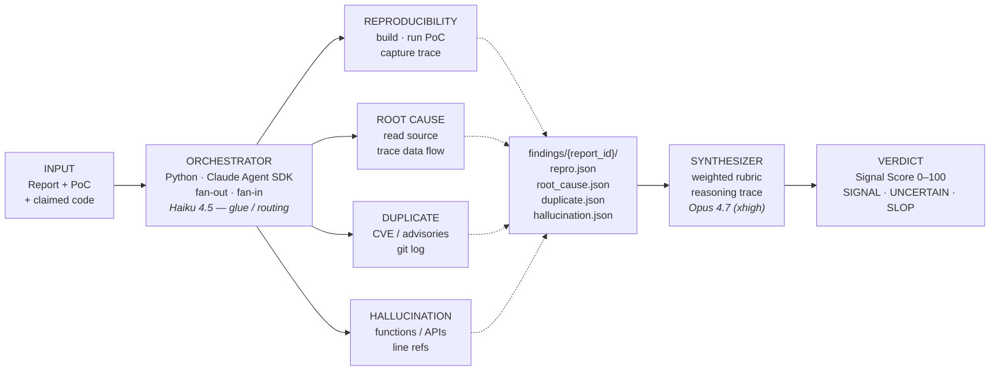

# TriageGuard

**Autonomous validator for vulnerability reports.** Drop in a report
+ PoC + claimed affected code; get back a Signal-vs-Slop verdict with
reasoning in ~12 minutes.

**Demo video (3 min):** https://youtube.com/shorts/jqrxefYqbO4

> Built for the Anthropic "Built with Opus 4.7" hackathon,
> 2026-04-21 – 2026-04-28.

## Why

The bug bounty industry is collapsing under AI-generated low-quality
reports. HackerOne paused the Internet Bug Bounty program on
2026-03-27 after 13 years. Google's OSS VRP rejects AI-generated
submissions outright. curl ended its program. Valid submission rate
at major programs dropped from ~15 % to under 5 %.

The ecosystem bottleneck has shifted from **discovery** to
**validation**. TriageGuard attacks that new bottleneck.

## How it works



`fan-out`: 4 sub-agents run in parallel (Opus 4.7 at `xhigh` effort).
`shared state` via `findings/{report_id}/` JSON artifacts.
`fan-in`: a deterministic synthesizer (not an LLM) maps the four
verdicts to a 0–100 Signal Score — auditable, reproducible, cheap.
The web UI streams the same artifacts via SSE.

Primary target: **wolfSSL** (C, cryptographic library, ~5 B devices).

## How Opus 4.7 is used

- **Long-horizon autonomy** — Agent A spends 10–15 min unattended
  cloning wolfSSL, building with ASan, running the PoC, and inspecting
  the crash.
- **Pushes back** — Agent D refuses to confirm plausible-looking
  references without evidence. This is the product's core trait.
- **Self-verification** — every sub-agent calls a `think` tool before
  emitting its verdict; adaptive thinking fires only where reasoning
  is hard.
- **Precise instruction following** — strict verdict schemas, closed
  enum values, zero hedging.

**Hybrid model split** — visible in the architecture diagram above:

- **Opus 4.7 at `xhigh`** for the four sub-agents and the synthesizer
  narrative. This is where the reasoning happens.
- **Haiku 4.5** for the orchestrator's preflight digest
  (`orchestrator/preflight.py`): a single ~$0.0015, ~1.5 s call that
  reads `INPUT.md` + `INPUT_meta.json` and writes a 4-bullet
  structured summary to `findings/{report_id}/INPUT_summary.json`
  (claimed bug class, claimed locations, claimed evidence, one-line
  risk read). The four Opus 4.7 sub-agents re-read the raw input
  themselves; Haiku's digest is purely a fast sanity check surfaced
  in the CLI output and the synthesizer narrative.

Fail-open by design: a Haiku error never blocks the sub-agents
(error logged, run continues). Opt out with `--no-haiku` if you want
to save the ~$0.0015. The split keeps cost on mechanical glue calls
~50× lower than running Opus on the same step, without giving up
Opus 4.7's depth on the calls that actually decide the verdict.

## Demo samples

Five evaluation samples in [`demo-inputs/`](demo-inputs/): two real
wolfSSL CVEs (mine), two public curl slop reports, and one
live-generated during the demo itself. Their `INPUT.md` and PoC files
are the canonical reference for how to shape your own input.

## Repo layout

```
orchestrator/         Python pipeline (Agent SDK orchestrator + synthesizer)
agents/               Per-sub-agent Python wrappers
web/                  Next.js + Tailwind + SSE consumer (the replay UI)
findings/             Per-run artifacts (git-ignored)
demo-inputs/          The five evaluation samples
Dockerfile.wolfssl    Sandboxed wolfSSL build for Agent A
.claude/              Claude Code harness — skills, agents, commands, hooks
```

## Getting started

```bash
# 1. Env — edit, don't commit.
cp .env.example .env  # fill ANTHROPIC_API_KEY
chmod 600 .env

# 2. Python deps (3.12+). Dev extras include pytest + ruff + mypy.
uv sync --extra dev  # or: pip install -e ".[dev]"

# 3. Prove the rubric works (no API calls).
pytest tests/

# 4. Build the wolfSSL sandbox (first time only, ~5 min).
docker build -f Dockerfile.wolfssl \
  --build-arg WOLFSSL_TAG=v5.6.4-stable \
  -t triageguard/wolfssl:v5.6.4-stable .

# 5. Run one sample.
python -m orchestrator demo-inputs/s1-cve-2026-3849
# Verdict appears under findings/{timestamp}_s1-cve-2026-3849/.
```

Inside Claude Code: read [.claude/RULES.md](.claude/RULES.md) first,
then use `/status` · `/record-finding` · `/run-sample` ·
`/demo-dryrun` · `/verify-done` · `/ship-check`.

## Run your own report

TriageGuard is a working pipeline, not a viewer of canned demos. To
triage an arbitrary report:

1. Create `demo-inputs/<your-id>/` with two files:
   - `INPUT_meta.json` — schema in
     [`orchestrator/schemas.py`](orchestrator/schemas.py) (`InputMeta`
     model). Required: `sample_id`, `submitter`, `target` (vendor,
     product, repo URL), `poc.present`, `submitted_at`, `expected`
     (label + score range).
   - `INPUT.md` — the human-readable advisory body.
2. (Optional) Add a `poc/` subdirectory with a runnable
   `reproduce.sh`. Agent A runs it inside the wolfSSL sandbox image.
   Without a PoC, Agent A returns `failed_to_reproduce` and the
   synthesizer downgrades the score appropriately — that's the point.
3. Run:
   ```
   python -m orchestrator demo-inputs/<your-id>
   ```
4. Open [`localhost:3100`](http://localhost:3100) (`pnpm --filter web
   dev`); the new case appears as a card on the home page automatically
   (the home page reads `findings/` from disk).

Cost per real run: ~$3–7 wall, ~10–15 min, depending on whether
Agent A reaches the PoC build step. See `demo-inputs/s1-cve-2026-3849/`
for a complete worked example.

## License

MIT. See [LICENSE](LICENSE).

## Credits

Built by [Haruto Kimura](mailto:harutokimura0608@gmail.com) — a bug
bounty researcher with 9 published CVEs across wolfSSL, Mozilla NSS,
and PowerDNS. "I helped create this crisis. TriageGuard is my
contribution to solving it."
